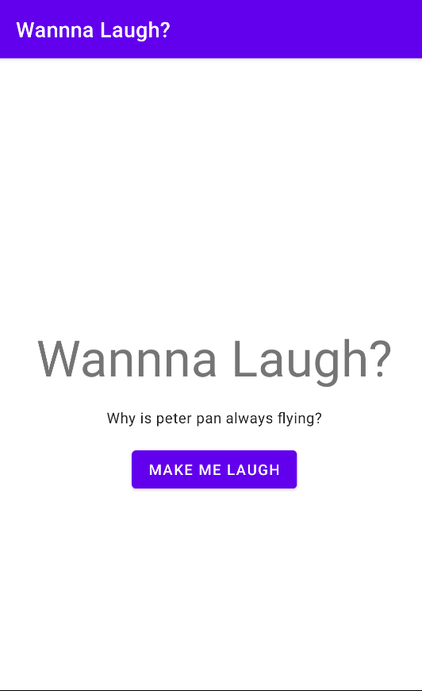
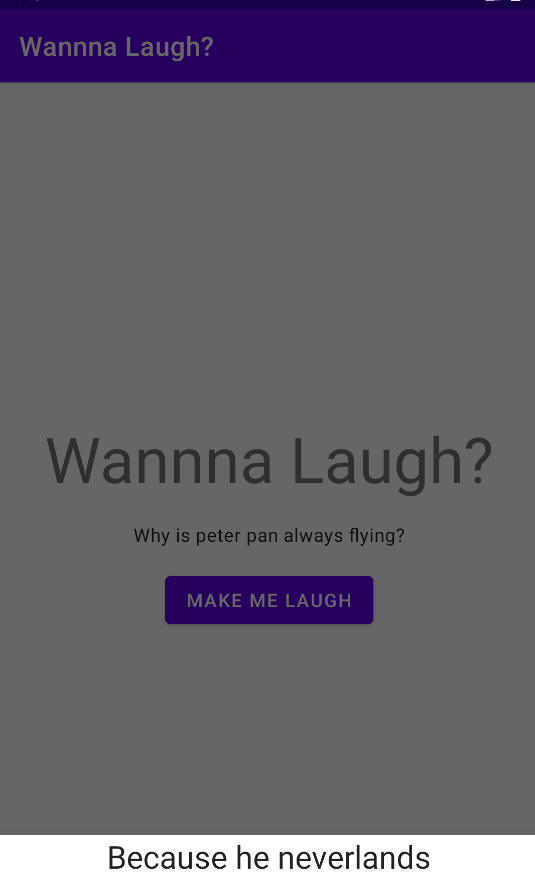

# WannaLaugh

 

A simple Android application created using MVVM architecture and the [Official Joke API](https://github.com/15Dkatz/official_joke_api)

Tech used:
* MVVM Architecture
* Coroutines
* ViewModel & LiveData
* Android Jetpack Navigation
* Retrofit
* Dependency Injection with Hilt
